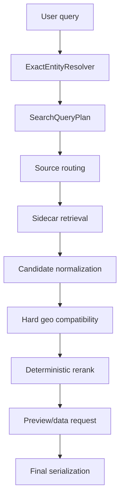

# Search V2 Geo Constraint Architecture

Generated: 2026-07-13

## Runtime Contract

Search V2 uses sidecar metadata and deterministic retrieval. Semantic retrieval remains disabled.

The geo contract is:

1. User supplied source constraints are authoritative.
2. User supplied geo constraints are authoritative.
3. Exact entity resolution enriches the plan but must not erase explicit user geo.
4. Preferred source is only a tie-breaker after source, geo, entity, and measure compatibility.
5. FTS score is a final tie-breaker, not a semantic or geo override.

## Canonical Geo Modes

Canonical candidates are interpreted through these modes:

| Mode | Meaning | Primary eligibility |
|---|---|---|
| `fixed` | Candidate has one fixed geo, either in metadata, entity registry, source scope, or stock suffix. | Must match explicit requested geo. |
| `dimensionable` | Dataset can be opened with a requested geo dimension. | Compatible only if the source can support the requested geo, or explicit supported geo metadata contains it. |
| `global` | Commodity/global aggregate where geography is not a country filter. | Primary only if the query has no country geo, or the aggregate evidence explicitly matches the requested aggregate. |
| `unknown` | No reliable geo evidence. | Cannot outrank a strong geo-compatible candidate for explicit-geo queries. |

## Decision Flow



The normalized geo is carried in the query plan and in the response trace:

```json
{
  "geo_trace": {
    "explicit_user_geo": ["CZ"],
    "normalized_geo": ["CZ"],
    "entity_resolver_geo": ["CZ"],
    "query_plan_geo": ["CZ"],
    "retrieval_geo": ["CZ"],
    "preview_geo": ["CZ"],
    "final_primary_geos": ["CZ"],
    "geo_constraint_satisfied": true
  }
}
```

## Compatibility Rules

Fixed geo:

- A fixed geo mismatch is dropped for primary results.
- A different fixed geo may only be useful for an explicitly comparative query.
- Stock suffix geo is generic market evidence, for example `.PR -> CZ` and `.F -> DE`.

Dimensionable geo:

- A dataset without fixed geo is not automatically valid for every country.
- If `supported_geographies`, `available_geographies`, or `geo_dimension_values` are present, they must include the requested geo.
- Otherwise, only known dimension-capable sources can pass, and preview/data must receive the requested geo.

Aggregate geo:

- `EU`, `U2`, and `GLOBAL` are distinct.
- Euro area (`U2`, `EA20`) must not be collapsed into a random member state.
- Country queries must not be satisfied by an EU/euro-area aggregate as an exact primary answer.

Unknown geo:

- Unknown geo is allowed for open-topic search.
- Unknown geo must not beat a strong candidate with matching explicit geo.

## Implementation Points

- `SearchV2QueryPlanner` normalizes explicit geo aliases and merges exact-entity fixed geo.
- `SearchV2GeoCompatibility` centralizes fixed, dimensionable, aggregate, entity, and stock-suffix geo checks.
- `SearchV2Service.applyHardConstraints` applies geo filtering before source balancing and reranking.
- `ExactEntityResolver` carries generic entity metadata such as `geo_mode`, `fixed_geo`, `market`, `return_type`, and `requested_return_type`.
- `SearchV2ExactEntityScorer` handles generic return-type preference, so total-return index requests do not prefer price-index rows.

## No Query-Specific Hardcode

The implementation does not add branches like `if query contains Czechia`, `if query contains ROA`,
or `if query contains Nasdaq`. The allowed mechanisms are registries and metadata:

- country alias registry
- aggregate geo hierarchy
- exact entity registry metadata
- source capability metadata
- stock exchange suffix metadata
- return-type metadata
